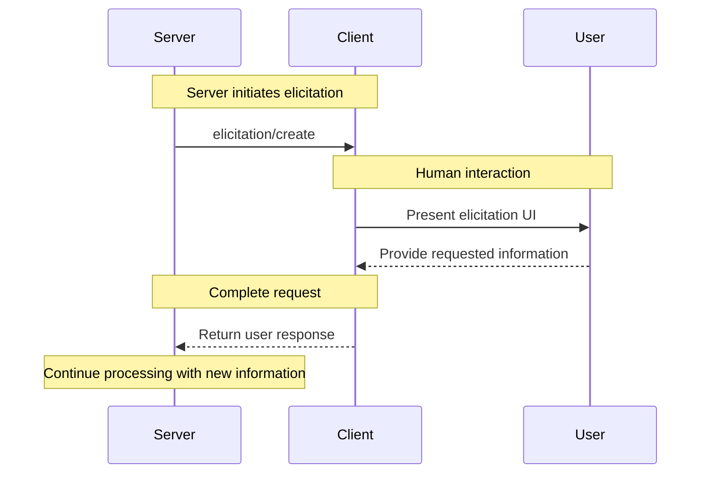

<Info>**Protocol Revision**: 2025-03-26</Info>

The Model Context Protocol (MCP) provides a standardized way for servers to request additional
information from users through the client during interactions. This flow allows clients to
maintain control over user interactions and data sharing while enabling servers to gather
necessary information dynamically&mdash;creating more interactive and context-aware experiences.
Servers can request text, image, or audio responses from users with optional structured schemas.

## User Interaction Model

Elicitation in MCP allows servers to implement interactive workflows by enabling user input
requests to occur _nested_ inside other MCP server features.

Implementations are free to expose elicitation through any interface pattern that suits
their needs&mdash;the protocol itself does not mandate any specific user interaction
model.

<Warning>
For trust & safety and security, there **SHOULD** always
be a human in the loop with the ability to deny elicitation requests.

Applications **SHOULD**:

- Provide UI that makes it clear which server is requesting information
- Allow users to review and modify their responses before sending
- Respect user privacy and provide clear cancel options
</Warning>

## Capabilities

Clients that support elicitation **MUST** declare the `elicitation` capability during
[initialization](/specification/2025-03-26/basic/lifecycle#initialization):

```json
{
  "capabilities": {
    "elicitation": {}
  }
}
```

The client declares support for elicitation during initialization.

## Protocol Messages

### Creating Elicitation Requests

To request information from a user, servers send an `elicitation/create` request:

**Request:**

```json
{
  "jsonrpc": "2.0",
  "id": 1,
  "method": "elicitation/create",
  "params": {
    "message": "Please provide your GitHub username"
  }
}
```

**Response:**

```json
{
  "jsonrpc": "2.0",
  "id": 1,
  "result": {
    "content": [
      {
        "type": "text",
        "text": "octocat"
      }
    ]
  }
}
```

**Request with multiple responses:**

```json
{
  "jsonrpc": "2.0",
  "id": 2,
  "method": "elicitation/create",
  "params": {
    "message": "What is your favorite color?"
  }
}
```

**Response:**

```json
{
  "jsonrpc": "2.0",
  "id": 2,
  "result": {
    "content": [
      {
        "type": "text",
        "text": "Blue"
      },
      {
        "type": "image",
        "data": "base64-encoded-image-data",
        "mimeType": "image/jpeg"
      }
    ]
  }
}
```

## Message Flow



## Data Types

### Elicitation Content

Responses to elicitation requests can contain an array of content items:

```json
"content": [
  {
    "type": "text",
    "text": "User's response text"
  },
  {
    "type": "image",
    "data": "base64-encoded-image-data",
    "mimeType": "image/jpeg"
  },
  {
    "type": "audio",
    "data": "base64-encoded-audio-data",
    "mimeType": "audio/wav"
  }
]
```

Each content item can be one of:

#### Text Content

```json
{
  "type": "text",
  "text": "User's response text"
}
```

#### Image Content

```json
{
  "type": "image",
  "data": "base64-encoded-image-data",
  "mimeType": "image/jpeg"
}
```

#### Audio Content

```json
{
  "type": "audio",
  "data": "base64-encoded-audio-data",
  "mimeType": "audio/wav"
}
```

## Error Handling

Clients **SHOULD** return errors for common failure cases:

Example when the user cancels:

```json
{
  "jsonrpc": "2.0",
  "id": 1,
  "result": {
    "content": [],
    "cancelled": true
  }
}
```

## Security Considerations

1. Clients **SHOULD** implement user approval controls
2. Both parties **SHOULD** validate elicitation content
3. Clients **SHOULD** provide clear indication of which server is requesting information
4. Clients **SHOULD** allow users to cancel elicitation requests at any time
5. Structured output should be validated against the provided schema when possible
