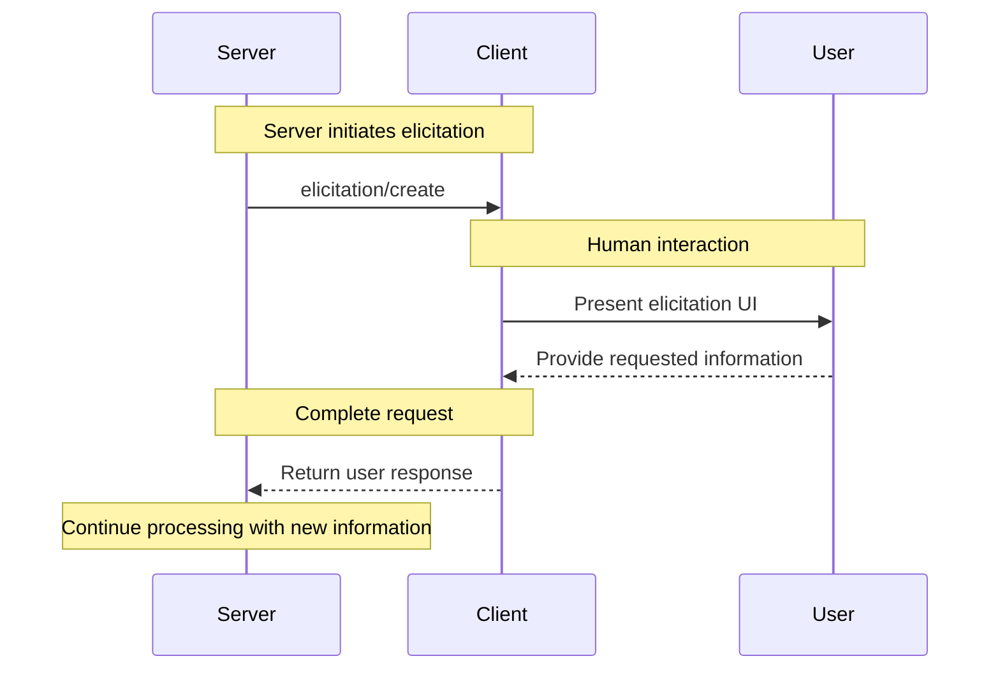

<Info>**Protocol Revision**: draft</Info>

The Model Context Protocol (MCP) provides a standardized way for servers to request additional
information from users through the client during interactions. This flow allows clients to
maintain control over user interactions and data sharing while enabling servers to gather
necessary information dynamically&mdash;creating more interactive and context-aware experiences.
Servers can request structured data from users with optional JSON schemas to validate responses.

## User Interaction Model

Elicitation in MCP allows servers to implement interactive workflows by enabling user input
requests to occur _nested_ inside other MCP server features.

Implementations are free to expose elicitation through any interface pattern that suits
their needs&mdash;the protocol itself does not mandate any specific user interaction
model.

<Warning>
For trust & safety and security, there **SHOULD** always
be a human in the loop with the ability to deny elicitation requests.

Applications **SHOULD**:

- Provide UI that makes it clear which server is requesting information
- Allow users to review and modify their responses before sending
- Respect user privacy and provide clear cancel options
</Warning>

## Capabilities

Clients that support elicitation **MUST** declare the `elicitation` capability during
[initialization](/specification/draft/basic/lifecycle#initialization):

```json
{
  "capabilities": {
    "elicitation": {}
  }
}
```

The client declares support for elicitation during initialization.

## Protocol Messages

### Creating Elicitation Requests

To request information from a user, servers send an `elicitation/create` request:

#### Simple Text Request

**Request:**

```json
{
  "jsonrpc": "2.0",
  "id": 1,
  "method": "elicitation/create",
  "params": {
    "message": "Please provide your GitHub username",
    "requestedSchema": {
      "type": "object",
      "properties": {
        "name": {
          "type": "string",
        },
      },
    }
  }
}
```

**Response:**

```json
{
  "jsonrpc": "2.0",
  "id": 1,
  "result": {
    "content": {
      "name": "octocat"
    }
  }
}
```

#### Structured Data Request with Schema

**Request:**

```json
{
  "jsonrpc": "2.0",
  "id": 2,
  "method": "elicitation/create",
  "params": {
    "message": "Please provide your contact information",
    "requestedSchema": {
      "type": "object",
      "properties": {
        "name": {
          "type": "string",
          "description": "Your full name"
        },
        "email": {
          "type": "string",
          "format": "email",
          "description": "Your email address"
        },
        "age": {
          "type": "number",
          "minimum": 18,
          "description": "Your age"
        }
      },
      "required": ["name", "email"]
    }
  }
}
```

**Response:**

```json
{
  "jsonrpc": "2.0",
  "id": 2,
  "result": {
    "content": {
      "name": "Monalisa Octocat",
      "email": "octocat@github.com",
      "age": 30
    }
  }
}
```

## Message Flow



## Request Schema

The `requestedSchema` field allows servers to define the structure of the expected response using JSON Schema. This follows the same pattern as the `inputSchema` field in the Tool interface:

```json
"requestedSchema": {
  "type": "object",
  "properties": {
    "propertyName": {
      "type": "string",
      "description": "Description of the property"
    },
    "anotherProperty": {
      "type": "number",
      "minimum": 0,
      "maximum": 100
    }
  },
  "required": ["propertyName"]
}
```

The schema can include:
- Property definitions with types
- Required field specifications
- Validation constraints (min/max values, patterns, formats)
- Descriptions for UI presentation

Clients can use this schema to:
1. Generate appropriate input forms
2. Validate user input before sending
3. Provide better guidance to users

## Response Content

Responses to elicitation requests contain a content object with key-value pairs:

```json
"content": {
  "propertyName": "value",
  "anotherProperty": 42
}
```

The structure of this object should match the schema provided in the request, if one was specified. If no schema was provided, the client can structure the response as appropriate for the use case.

## Error Handling

Clients **SHOULD** return standard JSON-RPC errors for common failure cases:

Example when the user cancels:

```json
{
  "jsonrpc": "2.0",
  "id": 1,
  "error": {
    "code": -1,
    "message": "User rejected the elicitation request"
  }
}
```

Example when validation fails:

```json
{
  "jsonrpc": "2.0",
  "id": 1,
  "error": {
    "code": -32602,
    "message": "Invalid parameters",
    "data": {
      "validationErrors": {
        "email": "Invalid email format"
      }
    }
  }
}
```

## Security Considerations

1. Clients **SHOULD** implement user approval controls
2. Both parties **SHOULD** validate elicitation content against the provided schema
3. Clients **SHOULD** provide clear indication of which server is requesting information
4. Clients **SHOULD** allow users to reject elicitation requests at any time
5. Clients **SHOULD** implement rate limiting
6. Both parties **MUST** handle sensitive data appropriately
