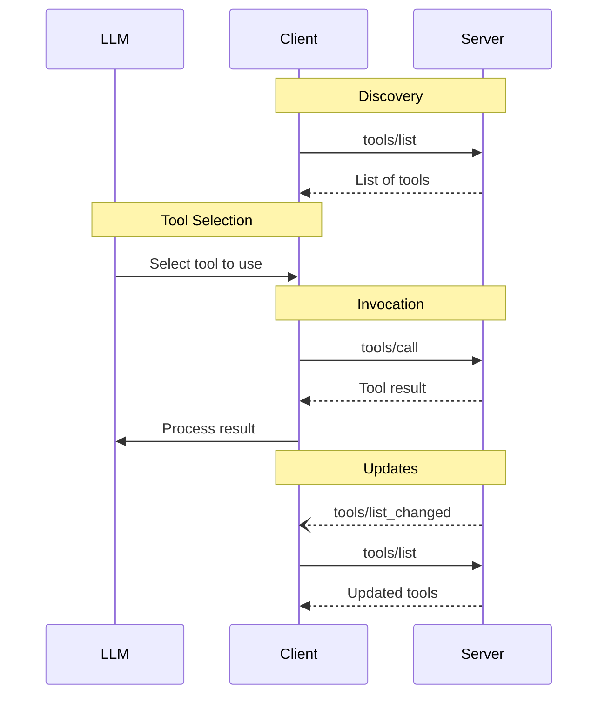

<Info>**Protocol Revision**: draft</Info>

The Model Context Protocol (MCP) allows servers to expose tools that can be invoked by
language models. Tools enable models to interact with external systems, such as querying
databases, calling APIs, or performing computations. Each tool is uniquely identified by
a name and includes metadata describing its schema.

## User Interaction Model

Tools in MCP are designed to be **model-controlled**, meaning that the language model can
discover and invoke tools automatically based on its contextual understanding and the
user's prompts.

However, implementations are free to expose tools through any interface pattern that
suits their needs&mdash;the protocol itself does not mandate any specific user
interaction model.

<Warning>
For trust & safety and security, there **SHOULD** always
be a human in the loop with the ability to deny tool invocations.

Applications **SHOULD**:

- Provide UI that makes clear which tools are being exposed to the AI model
- Insert clear visual indicators when tools are invoked
- Present confirmation prompts to the user for operations, to ensure a human is in the
  loop
</Warning>

## Capabilities

Servers that support tools **MUST** declare the `tools` capability:

```json
{
  "capabilities": {
    "tools": {
      "listChanged": true
    }
  }
}
```

`listChanged` indicates whether the server will emit notifications when the list of
available tools changes.

## Protocol Messages

### Listing Tools

To discover available tools, clients send a `tools/list` request. This operation supports
[pagination](/specification/draft/server/utilities/pagination).

**Request:**

```json
{
  "jsonrpc": "2.0",
  "id": 1,
  "method": "tools/list",
  "params": {
    "cursor": "optional-cursor-value"
  }
}
```

**Response:**

```json
{
  "jsonrpc": "2.0",
  "id": 1,
  "result": {
    "tools": [
      {
        "name": "get_weather",
        "description": "Get current weather information for a location",
        "inputSchema": {
          "type": "object",
          "properties": {
            "location": {
              "type": "string",
              "description": "City name or zip code"
            }
          },
          "required": ["location"]
        }
      }
    ],
    "nextCursor": "next-page-cursor"
  }
}
```

### Calling Tools

To invoke a tool, clients send a `tools/call` request:

**Request:**

```json
{
  "jsonrpc": "2.0",
  "id": 2,
  "method": "tools/call",
  "params": {
    "name": "get_weather",
    "arguments": {
      "location": "New York"
    }
  }
}
```

**Response:**

```json
{
  "jsonrpc": "2.0",
  "id": 2,
  "result": {
    "content": [
      {
        "type": "text",
        "text": "Current weather in New York:\nTemperature: 72°F\nConditions: Partly cloudy"
      }
    ],
    "isError": false
  }
}
```

### List Changed Notification

When the list of available tools changes, servers that declared the `listChanged`
capability **SHOULD** send a notification:

```json
{
  "jsonrpc": "2.0",
  "method": "notifications/tools/list_changed"
}
```

## Message Flow



## Data Types

### Tool

A tool definition includes:

- `name`: Unique identifier for the tool
- `description`: Human-readable description of functionality
- `inputSchema`: JSON Schema defining expected parameters
- `outputSchema`: Optional JSON Schema defining expected output structure
- `annotations`: optional properties describing tool behavior

<Warning>For trust & safety and security, clients **MUST** consider
tool annotations to be untrusted unless they come from trusted servers.</Warning>

### Tool Result

Tool results may be **structured** or **unstructured**, depending on whether the tool definition specifies an [output schema](#output-schema).

**Structured** tool results are JSON objects that are valid with respect to the tool's output schema.

**Unstructured** tool results can contain multiple content items of different types:

#### Text Content

```json
{
  "type": "text",
  "text": "Tool result text"
}
```

#### Image Content

```json
{
  "type": "image",
  "data": "base64-encoded-data",
  "mimeType": "image/png"
}
```

#### Audio Content

```json
{
  "type": "audio",
  "data": "base64-encoded-audio-data",
  "mimeType": "audio/wav"
}
```

#### Embedded Resources

[Resources](/specification/draft/server/resources) **MAY** be embedded, to provide additional context
or data, behind a URI that can be subscribed to or fetched again by the client later:

```json
{
  "type": "resource",
  "resource": {
    "uri": "resource://example",
    "mimeType": "text/plain",
    "text": "Resource content"
  }
}
```

### Output Schema

Tools that produce structured results can use the `outputSchema` property to provide a JSON Schema describing the expected structure of their output. 

When a tool specifies an `outputSchema`:

1. Clients **MUST** validate that results from that tool contain a `structuredContent` field whose contents validate against the declared `outputSchema`.

2. Servers **MUST** provide structured results in `structuredContent` that conform to the declared `outputSchema` of the tool.

<Info>
For backwards compatibility, a tool that declares an `outputSchema` may also return unstructured results in the `content` field.
* If present, the unstructured result should be functionally equivalent to the structured result. (For example, serialized JSON can be returned in a `TextContent` block.)
* Clients that support `structuredContent` should ignore the `content` field if present.
</Info>

Example tool with output schema:

```json
{
  "name": "get_weather_data",
  "description": "Get current weather conditions and forecast data for a location",
  "inputSchema": {
    "type": "object",
    "properties": {
      "location": {
        "type": "string",
        "description": "City name or zip code"
      },
      "units": {
        "type": "string",
        "enum": ["celsius", "fahrenheit"],
        "default": "celsius",
        "description": "Temperature unit"
      }
    },
    "required": ["location"]
  },
  "outputSchema": {
    "type": "object",
    "properties": {
      "current": {
        "type": "object",
        "properties": {
          "temperature": { "type": "number" },
          "humidity": { "type": "number" },
          "conditions": { "type": "string" },
          "wind": {
            "type": "object",
            "properties": {
              "speed": { "type": "number" },
              "direction": { "type": "string" }
            },
            "required": ["speed", "direction"]
          }
        },
        "required": ["temperature", "humidity", "conditions", "wind"]
      },
      "forecast": {
        "type": "array",
        "items": {
          "type": "object",
          "properties": {
            "date": { "type": "string", "format": "date" },
            "high": { "type": "number" },
            "low": { "type": "number" },
            "conditions": { "type": "string" }
          },
          "required": ["date", "high", "low", "conditions"]
        }
      },
      "location": {
        "type": "object",
        "properties": {
          "city": { "type": "string" },
          "country": { "type": "string" },
          "coordinates": {
            "type": "object",
            "properties": {
              "latitude": { "type": "number" },
              "longitude": { "type": "number" }
            },
            "required": ["latitude", "longitude"]
          }
        },
        "required": ["city", "country", "coordinates"]
      }
    },
    "required": ["current", "forecast", "location"]
  }
}
```

Example valid response for this tool:

```json
{
  "jsonrpc": "2.0",
  "id": 5,
  "result": {
    "structuredContent": {
      "current": {
        "temperature": 22.5,
        "humidity": 65,
        "conditions": "Partly cloudy",
        "wind": {
          "speed": 12,
          "direction": "NW"
        }
      },
      "forecast": [
        {
          "date": "2024-03-28",
          "high": 25,
          "low": 18,
          "conditions": "Sunny"
        },
        {
          "date": "2024-03-29",
          "high": 23,
          "low": 17,
          "conditions": "Cloudy"
        }
      ],
      "location": {
        "city": "San Francisco",
        "country": "US",
        "coordinates": {
          "latitude": 37.7749,
          "longitude": -122.4194
        }
      }
    }
  }
}
```

The `outputSchema` helps clients and LLMs understand and properly handle structured tool outputs by:

- Enabling strict schema validation of responses
- Providing type information for better integration with programming languages
- Guiding clients and LLMs to properly parse and utilize the returned data
- Supporting better documentation and developer experience

## Error Handling

Tools use two error reporting mechanisms:

1. **Protocol Errors**: Standard JSON-RPC errors for issues like:

   - Unknown tools
   - Invalid arguments
   - Server errors

2. **Tool Execution Errors**: Reported in tool results with `isError: true`:
   - API failures
   - Invalid input data
   - Business logic errors

Example protocol error:

```json
{
  "jsonrpc": "2.0",
  "id": 3,
  "error": {
    "code": -32602,
    "message": "Unknown tool: invalid_tool_name"
  }
}
```

Example tool execution error:

```json
{
  "jsonrpc": "2.0",
  "id": 4,
  "result": {
    "content": [
      {
        "type": "text",
        "text": "Failed to fetch weather data: API rate limit exceeded"
      }
    ],
    "isError": true
  }
}
```

## Security Considerations

1. Servers **MUST**:

   - Validate all tool inputs
   - Implement proper access controls
   - Rate limit tool invocations
   - Sanitize tool outputs

2. Clients **SHOULD**:
   - Prompt for user confirmation on sensitive operations
   - Show tool inputs to the user before calling the server, to avoid malicious or
     accidental data exfiltration
   - Validate tool results before passing to LLM
   - Implement timeouts for tool calls
   - Log tool usage for audit purposes
